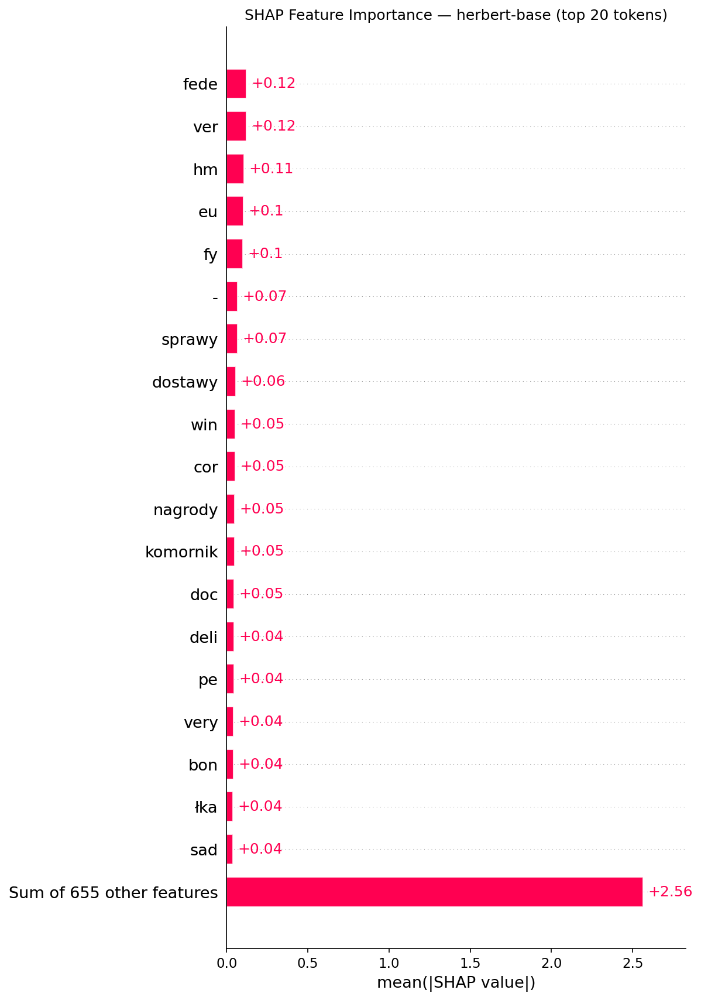
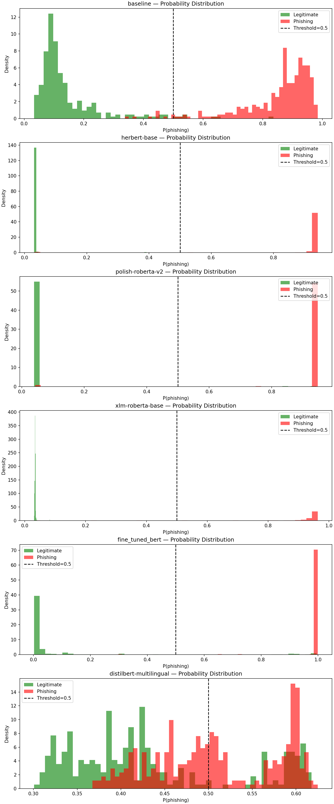

# Phishing Detection Using Transformer Models

A comprehensive study comparing traditional machine learning baselines with fine-tuned transformer models for detecting phishing messages in the Polish language. The project evaluates six classification approaches, implements a weighted ensemble method, and provides explainability analysis using SHAP.

---

**[Wersja polska ponizej / Polish version below](#wersja-polska)**

---

## Table of Contents

- [Overview](#overview)
- [Dataset](#dataset)
- [Models](#models)
- [Project Structure](#project-structure)
- [Installation](#installation)
- [Usage](#usage)
- [Results](#results)
- [Statistical Significance](#statistical-significance)
- [Ensemble Ablation Study](#ensemble-ablation-study)
- [Explainability (XAI)](#explainability-xai)
- [License](#license)

## Overview

Phishing remains one of the most prevalent cybersecurity threats. This project investigates whether transformer-based language models, pre-trained on Polish text corpora, can outperform classical TF-IDF + Logistic Regression pipelines in detecting phishing SMS and e-mail messages.

The research pipeline consists of nine automated stages:

1. Data preprocessing and normalization
2. Stratified train/validation/test splitting with feature extraction
3. Baseline model training (TF-IDF + Logistic Regression)
4. Fine-tuning of four transformer architectures
5. Model evaluation on the held-out test set
6. Decision threshold optimization with cost-sensitive analysis
7. Weighted ensemble inference
8. Stratified K-Fold cross-validation for reliability estimation
9. Advanced analyses: error analysis, McNemar tests, probability calibration, and ablation study

## Dataset

The dataset comprises 3,983 Polish-language messages (SMS and e-mail), generated using large language models to simulate realistic phishing and legitimate communications.

| Property | Value |
|---|---|
| Total samples | 3,983 |
| Phishing (positive class) | 2,214 (55.6%) |
| Legitimate (negative class) | 1,769 (44.4%) |
| SMS messages | 2,033 |
| E-mail messages | 1,950 |
| Train / Validation / Test split | 2,788 / 597 / 598 |

**Data sources by LLM generator:**

| Source | Samples |
|---|---|
| Gemini 3 | 3,600 |
| Grok 4.1 | 200 |
| GPT 5.1 | 100 |
| GPT-OSS-20B | 50 |
| DeepSeek R1 | 21 |
| Bielik v3.0 | 12 |

Each record contains structured metadata: message type, title, content, sender brand, topic category, suspicion level, LLM likeness score, language style, phishing technique, and a binary label.

## Models

### Baseline

- **TF-IDF + Logistic Regression** with n-gram range (1, 3), 50,000 max features, balanced class weights.

### Transformers

All transformer models were fine-tuned with the following shared configuration:

| Parameter | Value |
|---|---|
| Max sequence length | 256 tokens |
| Batch size | 4 |
| Epochs | 10 |
| Learning rate | 2e-5 |
| LR scheduler | Cosine with warmup (ratio=0.1) |
| Weight decay | 0.01 |
| Gradient accumulation steps | 4 |
| Early stopping patience | 3 epochs |
| Label smoothing | 0.1 |
| Loss function | Class-weighted CrossEntropyLoss |
| Data augmentation | On-the-fly character perturbation + feature tag dropout (30%) |

| Model | Pre-trained checkpoint |
|---|---|
| HerBERT | `allegro/herbert-base-cased` |
| Polish RoBERTa v2 | `sdadas/polish-roberta-base-v2` |
| XLM-RoBERTa | `FacebookAI/xlm-roberta-base` |
| DistilBERT Multilingual | `distilbert-base-multilingual-cased` |
| Fine-tuned BERT (HerBERT) | Previously trained HerBERT checkpoint |

### Ensemble

Weighted averaging of predicted probabilities from five models with the following weight distribution:

| Component | Weight |
|---|---|
| HerBERT | 0.25 |
| Fine-tuned BERT | 0.20 |
| Polish RoBERTa v2 | 0.20 |
| Baseline (TF-IDF + LR) | 0.20 |
| XLM-RoBERTa | 0.15 |

## Project Structure

```
phishing-transformer-detection/
|-- main.py                          # 9-step pipeline orchestrator
|-- params.yaml                      # Experiment hyperparameters
|-- pyproject.toml                   # Project metadata and dependencies
|-- src/
|   |-- config.py                    # Global constants (paths, column names)
|   |-- data/
|   |   |-- preprocess_data.py       # Raw data preprocessing
|   |   |-- split_data.py            # Stratified train/val/test split
|   |   |-- load_data.py             # Data loading utilities
|   |   |-- augmented_dataset.py     # On-the-fly augmentation dataset
|   |   |-- augment/                 # Offline augmentation scripts
|   |-- models/
|   |   |-- baseline.py              # TF-IDF + Logistic Regression
|   |   |-- fine_tune.py             # Transformer fine-tuning (WeightedTrainer)
|   |   |-- kfold_cv.py              # Stratified K-Fold cross-validation
|   |   |-- utils.py                 # Model loading and evaluation helpers
|   |-- evaluation/
|   |   |-- evaluate.py              # Model evaluation on test set
|   |   |-- threshold_analysis.py    # Threshold optimization with cost analysis
|   |   |-- ensemble.py              # Weighted ensemble inference
|   |   |-- analysis.py             # Error analysis, McNemar, ablation study
|   |   |-- explainer.py             # SHAP-based explainability
|   |-- features/
|   |   |-- extractor.py             # Feature extraction pipeline
|   |-- utils/
|       |-- logger.py                # Logging configuration
|-- notebooks/
|   |-- xai_analysis.ipynb                          # SHAP explainability analysis
|   |-- evaluate_baseline.ipynb                     # Baseline evaluation
|   |-- evaluate_fine_tuned_bert.ipynb               # Transformer evaluation
|   |-- comprehesive_model_and_feature_auditor.ipynb # Model auditing
|-- data/
|   |-- raw/                         # Raw data per LLM source
|   |-- processed/                   # Preprocessed CSV
|   |-- split/                       # Train/val/test CSVs
|-- results/                         # Evaluation outputs, plots, CSVs
|-- saved_models/                    # Trained model checkpoints
|-- mlruns/                          # MLflow experiment tracking
```

## Installation

**Requirements:** Python 3.10+ and [uv](https://docs.astral.sh/uv/) (recommended) or pip.

```bash
git clone https://github.com/jakubbielecki/phishing-transformer-detection.git
cd phishing-transformer-detection

# Using uv (recommended):
uv sync

# Using pip:
pip install -e .
```

## Usage

### Full pipeline

```bash
uv run python main.py
```

### Selective execution

```bash
# Skip data preprocessing (already done):
uv run python main.py --skip preprocess split

# Fine-tune only specific models:
uv run python main.py --only finetune --experiments herbert-base polish-roberta-v2

# Run evaluation and analysis only:
uv run python main.py --only evaluate threshold ensemble analysis

# K-Fold cross-validation for a single model:
uv run python main.py --only kfold --experiments herbert-base

# Custom ensemble threshold:
uv run python main.py --only ensemble --threshold 0.4
```

### Available pipeline steps

| Step | Description |
|---|---|
| `preprocess` | Preprocess raw data into structured CSV |
| `split` | Stratified train/val/test split with feature extraction |
| `baseline` | Train TF-IDF + Logistic Regression baseline |
| `finetune` | Fine-tune transformer models |
| `evaluate` | Evaluate all models on the test set |
| `threshold` | Threshold optimization analysis |
| `ensemble` | Weighted ensemble inference |
| `kfold` | Stratified K-Fold cross-validation |
| `analysis` | Error analysis, McNemar tests, ablation study |

## Results

### Individual Model Performance (Test Set, n=598)

| Model | F1 | Precision | Recall | ROC-AUC | Errors |
|---|---|---|---|---|---|
| Baseline (TF-IDF + LR) | 0.9743 | 0.9787 | 0.9699 | 0.9973 | 17 |
| HerBERT | 0.8803 | 1.0000 | 0.7861 | 0.9315 | 5 |
| Polish RoBERTa v2 | 0.8811 | 0.9925 | 0.7922 | 0.9650 | 7 |
| XLM-RoBERTa | 0.8988 | 1.0000 | 0.8163 | 0.9184 | 15 |
| Fine-tuned BERT | 0.9561 | 0.9605 | 0.9518 | 0.9906 | 16 |
| DistilBERT Multilingual | 0.7319 | 0.6917 | 0.7771 | 0.7862 | 223 |

### Ensemble Performance

| Configuration | F1 | Precision | Recall | ROC-AUC |
|---|---|---|---|---|
| 5-model weighted ensemble (threshold=0.35) | **0.9910** | 0.9910 | 0.9910 | 0.9996 |

### Error Profile

| Model | Total Errors | False Positives | False Negatives |
|---|---|---|---|
| HerBERT | 5 | 0 | 5 |
| Polish RoBERTa v2 | 7 | 2 | 5 |
| XLM-RoBERTa | 15 | 0 | 15 |
| Fine-tuned BERT | 16 | 15 | 1 |
| Baseline | 17 | 7 | 10 |
| DistilBERT Multilingual | 223 | 59 | 164 |

Key observation: HerBERT and XLM-RoBERTa produce zero false positives but suffer from lower recall (conservative classifiers). Fine-tuned BERT shows the inverse pattern with high recall but more false positives. The ensemble balances these complementary error profiles.

## Statistical Significance

Pairwise McNemar tests (chi-squared with continuity correction, significance level alpha=0.05):

| Pair | chi2 | p-value | Significant |
|---|---|---|---|
| Baseline vs. HerBERT | 6.05 | 0.0139 | Yes |
| Baseline vs. Polish RoBERTa v2 | 4.05 | 0.0442 | Yes |
| Baseline vs. XLM-RoBERTa | 0.03 | 0.8551 | No |
| Baseline vs. Fine-tuned BERT | 0.00 | 1.0000 | No |
| HerBERT vs. XLM-RoBERTa | 6.75 | 0.0094 | Yes |
| HerBERT vs. Fine-tuned BERT | 5.26 | 0.0218 | Yes |
| Polish RoBERTa v2 vs. XLM-RoBERTa | 3.50 | 0.0614 | No |

The results confirm that HerBERT and Polish RoBERTa v2 make statistically significantly different errors compared to the baseline. XLM-RoBERTa and Fine-tuned BERT do not differ significantly from the baseline in terms of error distribution, despite different precision-recall tradeoffs.

## Ensemble Ablation Study

All 57 possible combinations of 2-6 models were evaluated with equal weights at threshold=0.35. Top 5 results:

| Combination | F1 | Precision | Recall | ROC-AUC |
|---|---|---|---|---|
| Baseline + HerBERT + XLM-RoBERTa + DistilBERT | 0.9955 | 1.0000 | 0.9910 | 0.9997 |
| Baseline + XLM-RoBERTa | 0.9940 | 0.9970 | 0.9910 | 0.9997 |
| Baseline + HerBERT + XLM-RoBERTa | 0.9939 | 1.0000 | 0.9880 | 0.9997 |
| Baseline + Polish RoBERTa + XLM-RoBERTa + DistilBERT | 0.9925 | 0.9940 | 0.9910 | 0.9996 |
| HerBERT + XLM-RoBERTa + DistilBERT | 0.9924 | 1.0000 | 0.9849 | 0.9969 |

Notably, the simple 2-model combination of Baseline + XLM-RoBERTa achieves F1=0.9940, demonstrating that prediction diversity matters more than individual model strength. The inclusion of the weaker DistilBERT model in the top-performing 4-model combination further confirms this principle.

## Explainability (XAI)

SHAP (SHapley Additive exPlanations) analysis was conducted using the HerBERT model to identify the most influential tokens in phishing classification decisions.



Top tokens contributing to phishing predictions include domain-related subwords (e.g., "fede", "ver"), urgency indicators ("sprawy", "dostawy"), and reward-related terms ("nagrody", "win", "bon"). The analysis reveals that the model successfully captures semantic patterns characteristic of Polish-language phishing campaigns.

Probability distribution analysis shows that HerBERT, Polish RoBERTa v2, and XLM-RoBERTa exhibit near-binary calibration (probabilities concentrated near 0 and 1), while the baseline produces a smoother distribution offering better score separability.



## License

This project is licensed under the MIT License. See [LICENSE](LICENSE) for details.

Copyright (c) 2026 Jakub Bielecki

---

# Wersja polska

# Wykrywanie phishingu z wykorzystaniem modeli transformer

Kompleksowe badanie porownujace tradycyjne metody uczenia maszynowego z dostrojonymi modelami transformer w zadaniu wykrywania wiadomosci phishingowych w jezyku polskim. Projekt obejmuje ewaluacje szesciu podejsc klasyfikacyjnych, implementuje metode zespolowa (ensemble) z wazeniem oraz przeprowadza analize wyjasnialnosci z wykorzystaniem SHAP.

---

## Spis tresci

- [Opis projektu](#opis-projektu)
- [Zbior danych](#zbior-danych)
- [Modele](#modele)
- [Struktura projektu](#struktura-projektu)
- [Instalacja](#instalacja)
- [Uruchomienie](#uruchomienie)
- [Wyniki](#wyniki)
- [Istotnosc statystyczna](#istotnosc-statystyczna)
- [Badanie ablacyjne ensemble](#badanie-ablacyjne-ensemble)
- [Wyjasnialnosc (XAI)](#wyjasnialnosc-xai)
- [Licencja](#licencja)

## Opis projektu

Phishing pozostaje jednym z najczestszych zagrozen cyberbezpieczenstwa. Niniejszy projekt bada, czy modele jezykowe typu transformer, wstepnie wytrenowane na polskich korpusach tekstowych, moga przewyzszyc klasyczne metody bazujace na TF-IDF i regresji logistycznej w wykrywaniu phishingowych wiadomosci SMS i e-mail.

Pipeline badawczy sklada sie z dziewieciu zautomatyzowanych etapow:

1. Preprocessing i normalizacja danych
2. Stratyfikowany podzial na zbiory treningowy/walidacyjny/testowy z ekstrakcja cech
3. Trening modelu bazowego (TF-IDF + Regresja Logistyczna)
4. Dostrajanie (fine-tuning) czterech architektur transformer
5. Ewaluacja modeli na zbiorze testowym
6. Optymalizacja progu decyzyjnego z analiza kosztowa
7. Inferencja z wykorzystaniem wazonego ensemble
8. Stratyfikowana K-krotna walidacja krzyzowa
9. Analizy zaawansowane: analiza bledow, testy McNemara, kalibracja prawdopodobienstw, badanie ablacyjne

## Zbior danych

Zbior danych liczy 3 983 wiadomosci w jezyku polskim (SMS i e-mail), wygenerowanych przy uzyciu duzych modeli jezykowych w celu symulacji realistycznych wiadomosci phishingowych i legitnych.

| Wlasciwosc | Wartosc |
|---|---|
| Laczna liczba probek | 3 983 |
| Phishing (klasa pozytywna) | 2 214 (55,6%) |
| Wiadomosci legitne (klasa negatywna) | 1 769 (44,4%) |
| Wiadomosci SMS | 2 033 |
| Wiadomosci e-mail | 1 950 |
| Podzial treningowy / walidacyjny / testowy | 2 788 / 597 / 598 |

**Zrodla danych wg generatora LLM:**

| Zrodlo | Liczba probek |
|---|---|
| Gemini 3 | 3 600 |
| Grok 4.1 | 200 |
| GPT 5.1 | 100 |
| GPT-OSS-20B | 50 |
| DeepSeek R1 | 21 |
| Bielik v3.0 | 12 |

Kazdy rekord zawiera ustrukturyzowane metadane: typ wiadomosci, tytul, tresc, marka nadawcy, kategoria tematyczna, poziom podejrzliwosci, wskaznik podobienstwa do LLM, styl jezykowy, technika phishingowa oraz etykieta binarna.

## Modele

### Model bazowy (baseline)

- **TF-IDF + Regresja Logistyczna** z zakresem n-gramow (1, 3), 50 000 cech, zrownowazonym wazeniem klas.

### Transformery

Wszystkie modele transformer dostrajano z nastepujaca wspolna konfiguracja:

| Parametr | Wartosc |
|---|---|
| Maksymalna dlugosc sekwencji | 256 tokenow |
| Rozmiar batcha | 4 |
| Liczba epok | 10 |
| Wspolczynnik uczenia | 2e-5 |
| Scheduler LR | Cosine z rozgrzewka (ratio=0.1) |
| Regularyzacja wag | 0.01 |
| Akumulacja gradientow | 4 kroki |
| Wczesne zatrzymanie | Cierpliwosc 3 epoki |
| Wygladzanie etykiet | 0.1 |
| Funkcja straty | CrossEntropyLoss z wagami klas |
| Augmentacja danych | Perturbacje znakowe w locie + dropout tagow cech (30%) |

| Model | Pretrenowany checkpoint |
|---|---|
| HerBERT | `allegro/herbert-base-cased` |
| Polish RoBERTa v2 | `sdadas/polish-roberta-base-v2` |
| XLM-RoBERTa | `FacebookAI/xlm-roberta-base` |
| DistilBERT Multilingual | `distilbert-base-multilingual-cased` |
| Fine-tuned BERT (HerBERT) | Wczesniej wytrenowany checkpoint HerBERT |

### Ensemble

Wazone usrednianie prawdopodobienstw z pieciu modeli:

| Komponent | Waga |
|---|---|
| HerBERT | 0,25 |
| Fine-tuned BERT | 0,20 |
| Polish RoBERTa v2 | 0,20 |
| Baseline (TF-IDF + LR) | 0,20 |
| XLM-RoBERTa | 0,15 |

## Struktura projektu

```
phishing-transformer-detection/
|-- main.py                          # Orkiestrator pipeline (9 krokow)
|-- params.yaml                      # Hiperparametry eksperymentow
|-- pyproject.toml                   # Metadane projektu i zaleznosci
|-- src/
|   |-- config.py                    # Stale globalne (sciezki, nazwy kolumn)
|   |-- data/
|   |   |-- preprocess_data.py       # Preprocessing danych surowych
|   |   |-- split_data.py            # Stratyfikowany podzial danych
|   |   |-- load_data.py             # Narzedzia do ladowania danych
|   |   |-- augmented_dataset.py     # Augmentacja danych w locie
|   |   |-- augment/                 # Skrypty augmentacji offline
|   |-- models/
|   |   |-- baseline.py              # TF-IDF + Regresja Logistyczna
|   |   |-- fine_tune.py             # Fine-tuning transformerow (WeightedTrainer)
|   |   |-- kfold_cv.py              # Stratyfikowana K-krotna walidacja krzyzowa
|   |   |-- utils.py                 # Narzedzia do ladowania i ewaluacji modeli
|   |-- evaluation/
|   |   |-- evaluate.py              # Ewaluacja modeli na zbiorze testowym
|   |   |-- threshold_analysis.py    # Optymalizacja progu z analiza kosztowa
|   |   |-- ensemble.py              # Wazona inferencja zespolowa
|   |   |-- analysis.py             # Analiza bledow, McNemar, ablacja
|   |   |-- explainer.py             # Wyjasnialnosc oparta na SHAP
|   |-- features/
|   |   |-- extractor.py             # Pipeline ekstrakcji cech
|   |-- utils/
|       |-- logger.py                # Konfiguracja logowania
|-- notebooks/
|   |-- xai_analysis.ipynb                          # Analiza SHAP
|   |-- evaluate_baseline.ipynb                     # Ewaluacja baseline
|   |-- evaluate_fine_tuned_bert.ipynb               # Ewaluacja transformerow
|   |-- comprehesive_model_and_feature_auditor.ipynb # Audyt modeli
|-- data/
|   |-- raw/                         # Dane surowe wg zrodla LLM
|   |-- processed/                   # Przetworzone CSV
|   |-- split/                       # CSV treningowe/walidacyjne/testowe
|-- results/                         # Wyniki ewaluacji, wykresy, CSV
|-- saved_models/                    # Checkpointy wytrenowanych modeli
|-- mlruns/                          # Sledzenie eksperymentow MLflow
```

## Instalacja

**Wymagania:** Python 3.10+ oraz [uv](https://docs.astral.sh/uv/) (zalecane) lub pip.

```bash
git clone https://github.com/jakubbielecki/phishing-transformer-detection.git
cd phishing-transformer-detection

# Przy uzyciu uv (zalecane):
uv sync

# Przy uzyciu pip:
pip install -e .
```

## Uruchomienie

### Pelny pipeline

```bash
uv run python main.py
```

### Selektywne uruchomienie

```bash
# Pominiecie preprocessingu (juz wykonany):
uv run python main.py --skip preprocess split

# Fine-tuning tylko wybranych modeli:
uv run python main.py --only finetune --experiments herbert-base polish-roberta-v2

# Tylko ewaluacja i analizy:
uv run python main.py --only evaluate threshold ensemble analysis

# K-Fold walidacja krzyzowa dla jednego modelu:
uv run python main.py --only kfold --experiments herbert-base

# Niestandardowy prog ensemble:
uv run python main.py --only ensemble --threshold 0.4
```

### Dostepne kroki pipeline

| Krok | Opis |
|---|---|
| `preprocess` | Preprocessing danych surowych do ustrukturyzowanego CSV |
| `split` | Stratyfikowany podzial z ekstrakcja cech |
| `baseline` | Trening TF-IDF + Regresja Logistyczna |
| `finetune` | Fine-tuning modeli transformer |
| `evaluate` | Ewaluacja wszystkich modeli na zbiorze testowym |
| `threshold` | Analiza optymalizacji progu |
| `ensemble` | Wazona inferencja zespolowa |
| `kfold` | Stratyfikowana K-krotna walidacja krzyzowa |
| `analysis` | Analiza bledow, testy McNemara, badanie ablacyjne |

## Wyniki

### Wydajnosc poszczegolnych modeli (zbior testowy, n=598)

| Model | F1 | Precyzja | Czulosc | ROC-AUC | Bledy |
|---|---|---|---|---|---|
| Baseline (TF-IDF + LR) | 0,9743 | 0,9787 | 0,9699 | 0,9973 | 17 |
| HerBERT | 0,8803 | 1,0000 | 0,7861 | 0,9315 | 5 |
| Polish RoBERTa v2 | 0,8811 | 0,9925 | 0,7922 | 0,9650 | 7 |
| XLM-RoBERTa | 0,8988 | 1,0000 | 0,8163 | 0,9184 | 15 |
| Fine-tuned BERT | 0,9561 | 0,9605 | 0,9518 | 0,9906 | 16 |
| DistilBERT Multilingual | 0,7319 | 0,6917 | 0,7771 | 0,7862 | 223 |

### Wydajnosc ensemble

| Konfiguracja | F1 | Precyzja | Czulosc | ROC-AUC |
|---|---|---|---|---|
| 5-modelowy wazony ensemble (prog=0,35) | **0,9910** | 0,9910 | 0,9910 | 0,9996 |

### Profil bledow

| Model | Laczne bledy | Falszywie pozytywne | Falszywie negatywne |
|---|---|---|---|
| HerBERT | 5 | 0 | 5 |
| Polish RoBERTa v2 | 7 | 2 | 5 |
| XLM-RoBERTa | 15 | 0 | 15 |
| Fine-tuned BERT | 16 | 15 | 1 |
| Baseline | 17 | 7 | 10 |
| DistilBERT Multilingual | 223 | 59 | 164 |

Kluczowa obserwacja: HerBERT i XLM-RoBERTa nie generuja falszywie pozytywnych wynikow, ale charakteryzuja sie nizsza czuloscia (klasyfikatory konserwatywne). Fine-tuned BERT prezentuje odwrotny wzorzec -- wysoka czulosc przy wiekszej liczbie falszywych alarmow. Ensemble rownowazy te komplementarne profile bledow.

## Istotnosc statystyczna

Parzyste testy McNemara (chi-kwadrat z korekcja ciaglosci, poziom istotnosci alfa=0,05):

| Para | chi2 | p-value | Istotna |
|---|---|---|---|
| Baseline vs. HerBERT | 6,05 | 0,0139 | Tak |
| Baseline vs. Polish RoBERTa v2 | 4,05 | 0,0442 | Tak |
| Baseline vs. XLM-RoBERTa | 0,03 | 0,8551 | Nie |
| Baseline vs. Fine-tuned BERT | 0,00 | 1,0000 | Nie |
| HerBERT vs. XLM-RoBERTa | 6,75 | 0,0094 | Tak |
| HerBERT vs. Fine-tuned BERT | 5,26 | 0,0218 | Tak |
| Polish RoBERTa v2 vs. XLM-RoBERTa | 3,50 | 0,0614 | Nie |

Wyniki potwierdzaja, ze HerBERT i Polish RoBERTa v2 popelniaja statystycznie istotnie rozne bledy w porownaniu z baseline. XLM-RoBERTa i Fine-tuned BERT nie roznia sie istotnie od baseline pod wzgledem rozkladu bledow, pomimo odmiennych kompromisow precyzja-czulosc.

## Badanie ablacyjne ensemble

Przetestowano wszystkie 57 mozliwych kombinacji 2-6 modeli z rownymi wagami przy progu 0,35. Najlepsze 5 wynikow:

| Kombinacja | F1 | Precyzja | Czulosc | ROC-AUC |
|---|---|---|---|---|
| Baseline + HerBERT + XLM-RoBERTa + DistilBERT | 0,9955 | 1,0000 | 0,9910 | 0,9997 |
| Baseline + XLM-RoBERTa | 0,9940 | 0,9970 | 0,9910 | 0,9997 |
| Baseline + HerBERT + XLM-RoBERTa | 0,9939 | 1,0000 | 0,9880 | 0,9997 |
| Baseline + Polish RoBERTa + XLM-RoBERTa + DistilBERT | 0,9925 | 0,9940 | 0,9910 | 0,9996 |
| HerBERT + XLM-RoBERTa + DistilBERT | 0,9924 | 1,0000 | 0,9849 | 0,9969 |

Godne uwagi jest, ze prosta kombinacja 2-modelowa Baseline + XLM-RoBERTa osiaga F1=0,9940, co dowodzi, ze roznorodnosc predykcji jest wazniejsza niz indywidualna sila modelu. Obecnosc slabszego DistilBERT w najlepszej kombinacji 4-modelowej dodatkowo potwierdza te zasade.

## Wyjasnialnosc (XAI)

Analiza SHAP (SHapley Additive exPlanations) zostala przeprowadzona z wykorzystaniem modelu HerBERT w celu identyfikacji najbardziej wplywowych tokenow w decyzjach klasyfikacyjnych dotyczacych phishingu.


Najwazniejsze tokeny wskazujace na phishing obejmuja podslowa zwiazane z domenami (np. "fede", "ver"), wskazniki pilnosci ("sprawy", "dostawy") oraz terminy zwiazane z nagrodami ("nagrody", "win", "bon"). Analiza ujawnia, ze model skutecznie wychwytuje wzorce semantyczne charakterystyczne dla polskojezycznych kampanii phishingowych.

Analiza rozkladu prawdopodobienstw pokazuje, ze HerBERT, Polish RoBERTa v2 i XLM-RoBERTa wykazuja niemal binarna kalibracje (prawdopodobienstwa skoncentrowane w okolicach 0 i 1), podczas gdy baseline generuje lagodniejszy rozklad oferujacy lepsza separowalnosc wynikow.


## Licencja

Projekt jest udostepniony na licencji MIT. Szczegoly w pliku [LICENSE](LICENSE).

Copyright (c) 2026 Jakub Bielecki